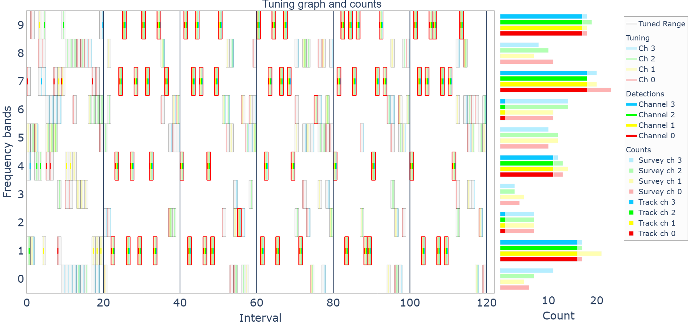

Efficient sensor scheduling is a critical challenge in multi-functional passive surveillance systems, where hardware resources must be optimally allocated to balance multiple objectives, such as electromagnetic spectrum survey and target tracking. This paper frames the sensor scheduling problem within the Optimal Experimental Design (OED) paradigm, leveraging information-theoretic and Bayesian optimization principles. We formulate the scheduling task as a multi-objective optimization problem, where one objective aims to maximize information gain in target tracking using Rényi divergence, while the other seeks to ensure an unbiased survey of the frequency spectrum through Kullback-Leibler divergence minimization. To effectively handle the trade-offs between these conflicting goals, we apply goal programming scalarization, offering a more robust alternative to traditional epsilon-constraint methods. A simulation-based case study demonstrates how the proposed optimization framework dynamically adjusts sensor tuning strategies, achieving a balanced allocation of system resources. The results highlight the potential of experimental design methodologies for improving real-time sensor tasking in complex, uncertain environments. This work bridges the gap between decision-theoretic experimental desig and practical sensor scheduling applications, providing insights applicable to adaptive sensing, electronic warfare, and autonomous surveillance systems.

# Introduction

There are two main functions of the passive multilateration surveillance system considered in our current work

* **signal spectrum survey** - aim is to maximize the probabiltiy of interception (PoI) for each emitter present in the (spatial and frequency) domain of the system while preventing the synchronization phenomenon,
* **tracking of non-cooperative targets** - aim is to update the state information about tracked targets so that the quality of tracking is maintained for all of them.

Both of these functions are mainly influenced by the sensor tuning plan. 
We assume multiple individual receivers $N = \{n \in \mathbb{N}_0 \,|\, 0 \leq n < N_{max}\}$, of them each can be tuned to one of the frequency bands of the set $M = \{m \in \mathbb{N}_0 \,|\, 0 \leq m < M_{max}\}$. Any number of targets $J_m$ can emitt in each band. The tuning plan $\mathbf{X} \in M^{N_{max} T_{max}}$ is then a matrix where the individual elements represent a specific measurement interval and a specific receiver. Their value corresponds to the index of the frequency band that we want to tune $x_{n,t} \in M$

$$
\begin{align}
        \mathbf{X}=
        \begin{bmatrix}
            x_{0,0} & \cdots & x_{0, T_{max}}\\
            \vdots & \ddots & \vdots\\
            x_{N_{max},0} & \cdots & x_{N_{max}, T_{max}}
        \end{bmatrix}.
    \end{align}
$$

# Surveillance objective function

There is a detailed study about receiver search strategies, a consequence of using periodic strategies without prior spectrum knowledge, and optimized random search strategy based on a CTMC. It was shown that the criteria of maximum expected intercept time (MEIT) and mean sojourn time $\mu$ can be translated to setting some constrains on eigenvalues of the CTMC rate matrix. The optimal CTMC rate matrix is then
    
$$
    \mathbf{Q}^{*} = \frac{\mu}{n-1}\left( \mathbf{\pmb{\pi}} \mathbf{1} \mathbf{I} - \mathbf{1} \mathbf{\pmb{\pi}} \right)
$$

where $\mathbf{1}$ is the column vector of ones of length $n$ and $\mathbf{I}$ is the identity matrix of dimension $n$. The Markov chain stationary distribution is denoted by the row vector $\pmb{\pi}$. \\
Thanks to the independence of each receiver's tuning random strategy, we can rewrite the posterior distribution of the multistatic model hyperparameter

$$
    \pi'_{n,\cdot} \mid x_{n,\cdot}, \alpha_{n,\cdot} \sim \mathrm{Dir}(o_{n,\cdot}+\alpha_{n,\cdot}),
$$

where $o_{n,\cdot}$ represents the number of occurrences of each band index (i.e. states of Markov chain) in the observed sequence $x_{n,\cdot}$. The observed sequence $x_{n,\cdot}$ is the proposed tuning plan for one particular receiver. \\
Based on the estimated stationary distribution $\pi'_{n,\cdot}(x_{n,\cdot})$ of the observed sequence $x_{n,\cdot}$, we compute Kullback-Leibler divergence from the required stationary distribution $\pmb{\pi}_n$ of the DTMC (obtained by discretization of $\mathbf{Q}^{*}$) for each receiver independently. The objective function $f_{survey}$ then aggregates these partial KL divergences

$$
    f_{survey}(\mathbf{X}) = \sum_{n \in N} D_{KL}(\pi'_{n,\cdot}(x_{n,\cdot})  \,||\, \pmb{\pi}_n),
    %\label{eq_kl_criteria}
$$

where

$$
    \pi'_{n,\cdot}(x_{n,\cdot})=\mathsf{E}[\pi'_{n,\cdot} \mid x_{n,\cdot}, \alpha_{n,\cdot}].
    %\label{eq_stat_dist_est}
$$

# Tracking objective function

Track state inference is based on new measurements and assumptions about the target behavior (movement model and process noise). Our model of track multistatic objective function assumes that measurement is obtained iff all receivers are tuned to the same frequency band $m$. Based on this assumption, we derive variable $y_{0 \dots t}$ from the optimized variable $\mathbf{X}$ as follows:

$$
    y_{t} = \begin{cases} 1 & \text{if } x_{m, t} = x_{l, t} \text{ for } \forall m,l \in N \\ 0 & \text{otherwise}\end{cases}.
$$

We can write the expected value of KL divergence between conditional probability density function $h(\mathbf{x}_t | \mathcal{Z}_t)$ of track state $\mathbf{x}_t$ (e.g. position and velocity) given measurements $\mathcal{Z}_t$ (e.g. position) up to time $t$ and conditional probability density function $h(\mathbf{x}_t | \mathcal{Z}_{t-1})$ of track state $\mathbf{x}_t$ given measurements $\mathcal{Z}_{t-1}$ up to time $t-1$ as follows

$$
    \mathsf{E}[D_{KL} (h(\mathbf{x}_t | \mathcal{Z}_t) || h(\mathbf{x}_t | \mathcal{Z}_{t-1}))] = \int_{\mathbb{R}^m} f^*(\mathbf{z}_t| \mathcal{Z}_{t-1})  D_{KL} (h(\mathbf{x}_t | \mathcal{Z}_t) || h(\mathbf{x}_t | \mathcal{Z}_{t-1})) \, \mathrm{d} \mathbf{z}_t,
$$

where $f^*(\mathbf{z}_t | \mathcal{Z}_{t-1})$ is predictive probability density function of measurements and $\mathbf{z}_t$ is the measurement at time $t$. \\
The resulting objective $f_{track}$ is the sum of the maximum values for each time interval of the set $T$

$$
    f_{track}(\mathbf{X})=\sum_{t \in T} \max_{m \in M} e_{t}(\mathbf{X}, m),
$$

$$
\begin{aligned}
    e_t(\mathbf{X}, m) = \begin{cases} \frac{\sum_{j \in J_m}\mathsf{E}[D_{KL}^{j,t}]}{|J_m|}  &\text{if} \, |J_m| \neq 0 \\ 0 & \text{otherwise} \end{cases}.
\end{aligned}
$$

# Multi-Channel Multi-Objective Optimization Model

The following optimization problem integrates both tuning criteria and is optimized using genetic algorithm.

$$
    \begin{aligned}
        &\text{minimize} \quad d\bigl([\underbrace{\hat{f}_{survey}^{norm}, \hat{f}_{track}^{norm}}_\text{goals}], [f_{survey}^{norm} (\mathbf{X}), f_{track}^{norm}(\mathbf{X})]\bigr), \quad \text{subject to} \quad \quad \mathbf{X} \in M^{N_{max} T_{max}} \\
        &\text{where} \, d(p,q) \, \text{is the Euclidean distance}, \quad \text{and normalized objective (survey or track)} \\
        &f_{objective}^{norm} (\mathbf{X}) = \underbrace{\text{norm}}_{\text{min-max}}(f_{objective} (\mathbf{X}), \overbrace{f_{objective}^{min}, f_{objective}^{max}}^{\substack{\text{analytical/optimized limits}}})\\
        %&\text{and norm}(p,min,max) = \frac{p-min}{max-min}.
    \end{aligned}
$$

# Results

As a result of running our algorithm on simulated data, we have obtained tuning plan that is visualized in Fig.\ref{fig:tuning}. Tuning in each of the receving channel is distinguished by color. The cases when all four channels were tuned into the same frequency band are emphasized using red bounding box. One can see that these four channel tunings are prevalent in bands 1,4,7,9 as this is caused by the tracking objective in order to gain track update for the targets emitting there.

Above you can see resulting tuning plan for 10 frequency bands, 4 receivers, 4 targets in bands 1,4,7,9, random stationary distribution and $\Delta t = 0.03s$

## Our contributions

1. [J. Suja, P. Kulmon and M. Benko, *"Scheduling of multi-function multistatic sensor,"* in IEEE Transactions on Aerospace and Electronic Systems, 2025, doi: 10.1109/TAES.2025.3572871](https://ieeexplore.ieee.org/document/11012724)
2. [P. Kulmon, J. Suja and M. Benko, *"Scheduling of Multi-Function Sensor,"* in IEEE Transactions on Radar Systems, vol. 1, pp. 729-739, 2023, doi: 10.1109/TRS.2023.3335208](https://ieeexplore.ieee.org/document/10325557)
3. [J. Pikman, *Optimization of Tuning Plans for a Passive Surveillance System*, diploma thesis at CTU in Prague, under supervision of P. Sucha, P. Kulmon and J.Suja](https://dspace.cvut.cz/handle/10467/114901?locale-attribute=en)
4. [contributions to the NATO STO SET-302](https://www.sto.nato.int/Pages/activitieslisting.aspx)
5. [J. Suja and P. Kulmon, *"Scalarization of Multi-Function Sensor Scheduling Problem,"* 2024 New Trends in Signal Processing (NTSP), Demanovska Dolina, Slovakia, 2024, pp. 1-5, doi: 10.23919/NTSP61680.2024.10726299](https://ieeexplore.ieee.org/document/10726299)

