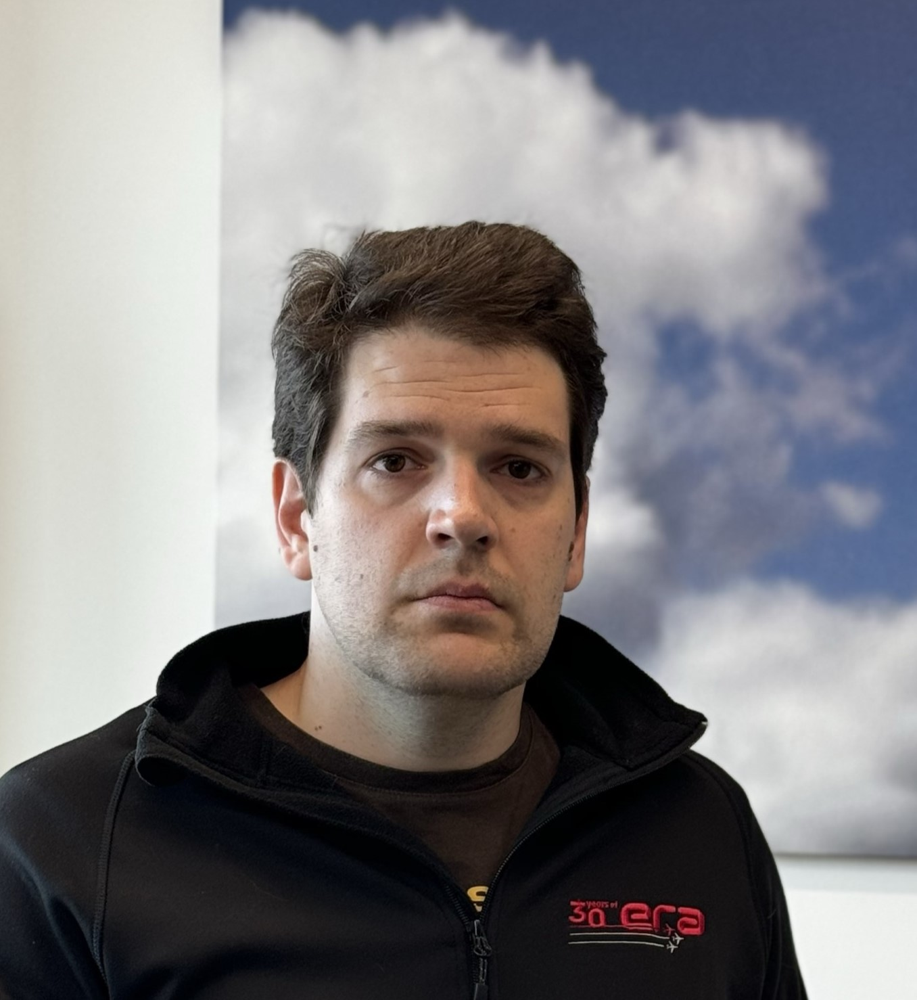

## Pavel Kulmon [ORCiD](https://orcid.org/0000-0003-3876-3460), [LinkedIn](https://www.linkedin.com/in/pavel-kulmon-b12087289/)

contact: p.kulmon (at) era.aero

Pavel Kulmon received the Master of Engineering degree in the field of geomatics and Ph.D. degree in systems engineering at the Czech Technical University in Prague, Czech Republic. He is a Senior Researcher with the Department of Research and Analysis, ERA. His main research interests include the field of statistical inference with focus on bayesian methods, together with machine learning, and reinforcement learning applications.

## Jerguš Suja [ORCiD](https://orcid.org/0009-0009-3421-3841), [LinkedIn](https://www.linkedin.com/in/jergu%C5%A1-suja-20136b148/)

contact: j.suja (at) era.aero

Jerguš Suja received the Master of Engineering degree in the field of mathematical engineering from the Brno University of Technology, Czech Republic, where he is currently pursuing the Ph.D. degree in the field of applied mathematics. He is a Senior Developer with the Department of Software Development, ERA. His main research interests include the field of mathematical statistics in stochastic and dynamic optimization, together with reinforcement learning applications.

## Petra Štukovská [ORCiD](https://orcid.org/0009-0004-0575-1492), [LinkedIn](https://www.linkedin.com/in/petra-%C5%A1tukovsk%C3%A1-16b82399/)

contact: p.stukovska (at) era.aero

Petra Štukovská (formerly Cabalková) received the Master degree in the field of Statistics and Data Analysis from the Masaryk University in Brno, Czech Republic and Ph.D. degree in the field of Electronics and Communication Technologies from the Brno University of Technology, Czech Republic. She is Head of the Department of Research and Analysis, ERA. Her professional focus is on data analysis in the field of radar data processing.

## Matěj Benko [ORCiD](https://orcid.org/0009-0005-8311-6301)

contact: m.benko (at) era.aero

Matej Benko received the Master of Engineering degree in the field of mathematical engineering from the Brno University of Technology, Czech Republic, where he is currently pursuing the Ph.D. degree in the field of applied mathematics.,He is a Researcher with the Department of Research and Analysis, ERA. His main research interests include the field of mathematical statistics, probability theory, and theory of information.